# FindMy WebApp - A Multi-User Find My Alternative

[](https://github.com/ghd182/findmy-multiuser/actions)
[](https://opensource.org/licenses/MIT)
[](https://github.com/Ghodmode/findmy-multiuser) <!-- Update version badge if needed -->

A self-hosted, multi-user web application designed as an alternative to Apple's Find My service, focusing on tracking Apple devices (like AirTags, iPhones, MacBooks using `pyfindmy`) with a modern, responsive Material 3 interface.

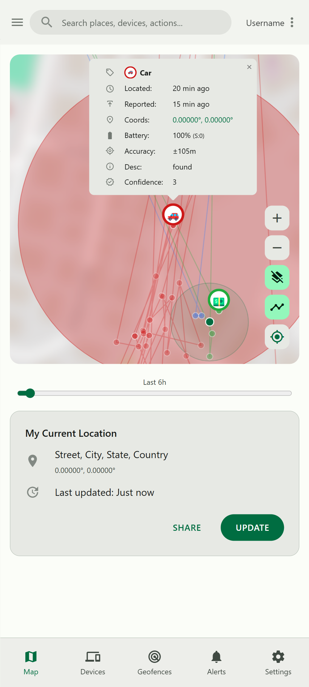
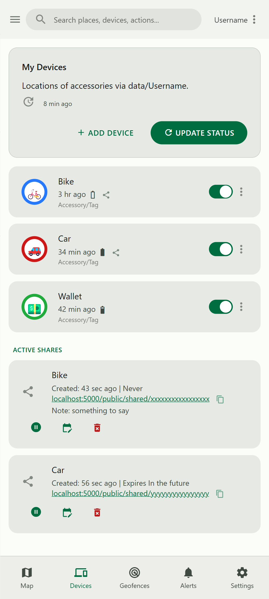
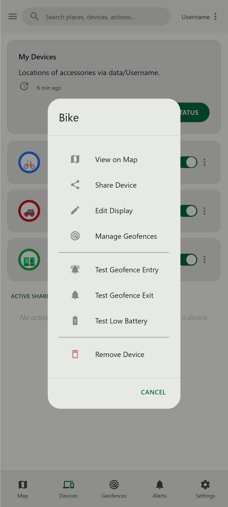
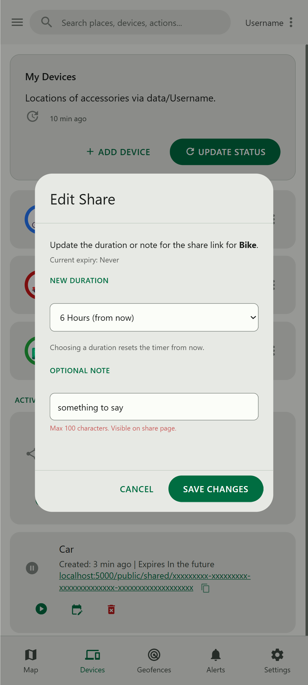
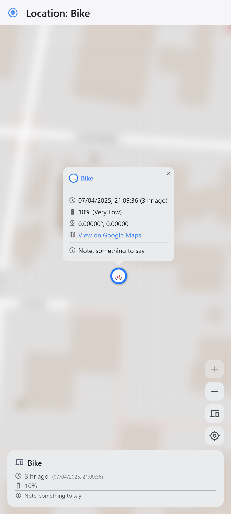
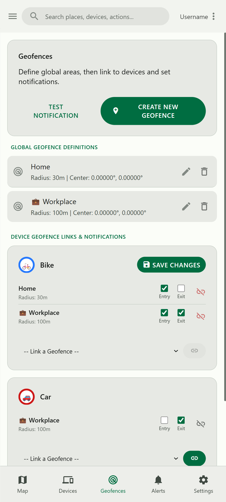
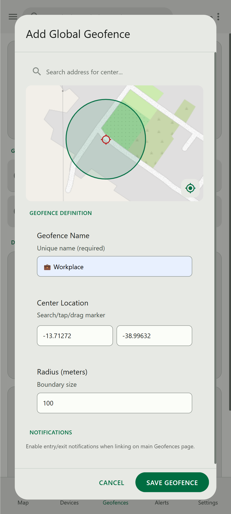
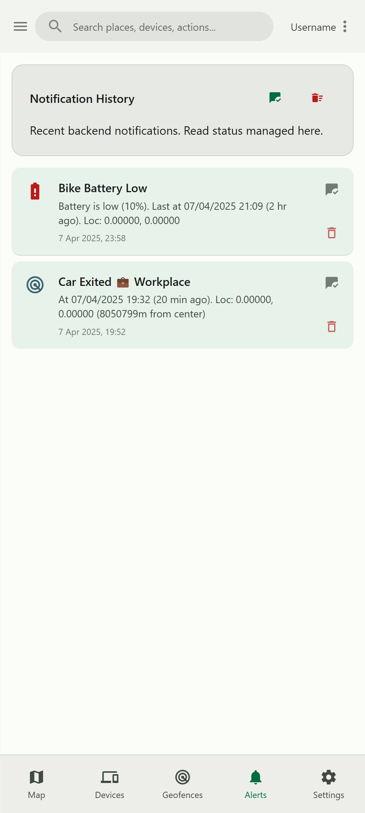

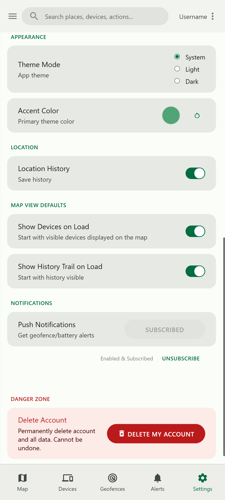
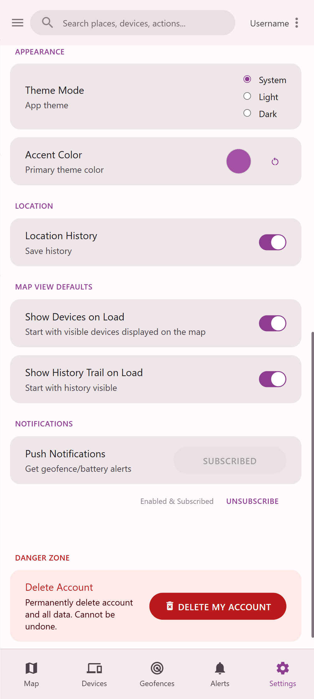
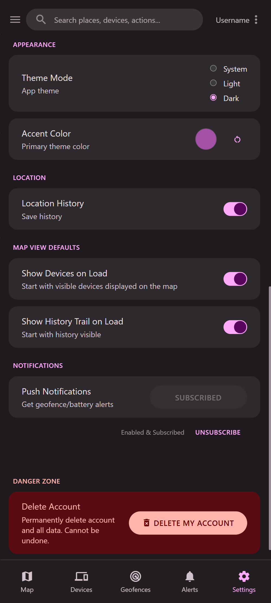

## Overview

This project provides a web interface accessible from any device to locate your Apple accessories. It fetches location data periodically using the `pyfindmy` library and presents it on an interactive map (OpenStreetMap via Leaflet.js). Key features include multi-user support with secure login, geofencing with notifications, low battery alerts, location history display, device sharing via public links, dynamic Material 3 theming, and PWA support. It's designed to be easily deployable via Docker, especially suitable for home servers like a Raspberry Pi.

## Key Features

*   **Multi-User Support:** Secure user registration and login. Each user manages their own Apple credentials and device data independently.
*   **Apple Device Tracking:** Locates accessories linked to an Apple ID using the `pyfindmy` library. Supports devices using `.plist` or `.keys` files. Fetches historical location data.
*   **Interactive Map:** Displays device locations on an OpenStreetMap base layer using Leaflet.js. Includes dynamic device icons (SVG), popups with details (address, battery, timestamp), and map controls (zoom, center, show all/history).
*   **Location History:** View the recent location history trail for visible devices on the map, with a time filter slider.
*   **Material 3 Design:** Modern, responsive interface adhering to Material 3 guidelines, including Light/Dark modes (system-following or manual override) and dynamic color theming based on user-selected accent color.
*   **Geofencing:** Create custom circular geofence zones on the map. Link geofences to specific devices and configure entry/exit notifications individually.
*   **Notifications:**
    *   **Geofence Alerts:** Receive push notifications upon device entry or exit from linked geofences.
    *   **Low Battery Alerts:** Receive push notifications when a device's battery level falls below a configurable threshold.
    *   **Web Push:** Uses Web Push API for real-time alerts (requires VAPID key setup and user permission).
    *   **Notification History:** View a history of alerts sent by the backend on a dedicated page. Manage read/unread status and delete history.
*   **Device Sharing:**
    *   Create secure, time-limited or indefinite public links to share a specific device's live location.
    *   Viewers access a simplified map page without needing to log in.
    *   Manage created share links (view, suspend/resume, update duration/note, delete permanently).
*   **Device Configuration:** Customize device display names, map icon labels (emojis), and colors. Toggle map visibility per device.
*   **Secure Credential Storage:** Apple passwords are encrypted using Fernet (requires `FERNET_SEED` or `FERNET_KEY`).
*   **Configuration Import/Export:** Backup and restore user configuration (devices, geofences, client settings) via JSON.
*   **Account Management:** Users can delete their account and all associated data.
*   **PWA Support:** Installable as a Progressive Web App for a more native feel, with basic offline caching for the app shell via Service Worker.
*   **Seed-Based Key Generation:** **(Recommended)** Deterministically generates `SECRET_KEY`, `FERNET_KEY`, and VAPID keys from user-provided seed environment variables for easier secret management and persistence across container restarts.
*   **Dockerized:** Easy deployment using Docker and Docker Compose, optimized for `linux/arm64/v8` (Raspberry Pi 4/5). Includes `ProxyFix` for running behind reverse proxies.

## Technology Stack

*   **Backend:** Python 3.11+, Flask, Waitress (WSGI)
*   **Device Interaction:** `pyfindmy` library
*   **Frontend:** Vanilla JavaScript (ES Modules), HTML5, CSS3
*   **Mapping:** Leaflet.js
*   **Styling:** Material 3 Design principles (CSS variables), Material Icons/Symbols, Material Color Utilities (JS library for dynamic theming)
*   **Push Notifications:** `pywebpush`, Web Push API
*   **Scheduling:** APScheduler
*   **Security/Auth:** Flask-Login, Flask-WTF (CSRF), Werkzeug password hashing, `cryptography` (Fernet, HKDF)
*   **Deployment:** Docker, Docker Compose

## Getting Started

### Prerequisites

*   **Python:** Version 3.11 or higher recommended.
*   **Pip:** Python package installer.
*   **Git:** For cloning the repository.
*   **Docker & Docker Compose:** (Required for Docker/Portainer deployment) Install Docker Engine and Docker Compose V2.
*   **(Optional) Anisette Server:** Required by `pyfindmy` for authentication. Public servers are configured by default (`ANISETTE_SERVERS` env var), but running your own instance is more reliable. See [Dadoum/anisette-v3-server](https://github.com/Dadoum/anisette-v3-server).
*   **Apple ID:** You will need an Apple ID.
    *   **2FA Accounts (Recommended):** If 2FA is enabled, you **must** generate and use an **App-Specific Password (ASP)**. Your regular Apple ID password will *not* work due to 2FA prompts. Generate via [appleid.apple.com](https://appleid.apple.com) ➔ Sign-In and Security ➔ App-Specific Passwords.
    *   **Non-2FA Accounts:** Using accounts *without* 2FA may work but is **strongly discouraged** for security reasons and may fail unpredictably with Apple's API changes.
*   **Device Files:** `.plist` or `.keys` files for the Apple devices you want to track (e.g., AirTags). Generated using tools like [OpenHaystack](https://github.com/seemoo-lab/openhaystack).

### Configuration (Environment Variables & Seeds)

This application relies on environment variables for configuration, especially secrets. **Using the SEED variables is the strongly recommended method for key management.**

1.  **Generate Seeds:** Create three unique, strong, secret phrases (keep these secure!). Use a password manager or the following commands:
    *   **Secret Seed (for Flask `SECRET_KEY`):**
        ```bash
        python -c "import secrets; print(secrets.token_hex(32))"
        ```
    *   **Fernet Seed (for `FERNET_KEY` encryption):**
        ```bash
        python -c "import secrets; print(secrets.token_hex(32))"
        ```
    *   **VAPID Seed (for Push Notification Keys):**
        ```bash
        python -c "import secrets; print(secrets.token_hex(32))"
        ```
    *   **Important:** Use *different*, long, unpredictable strings for each seed.

2.  **Set Environment Variables:** Provide these seeds and other required variables depending on your deployment method (see below).

    **Required Variables:**
    *   `FLASK_ENV`: Set to `production` (recommended for Docker/Portainer) or `development` (for local).
    *   `SECRET_SEED`: Your generated seed for the Flask secret key.
    *   `FERNET_SEED`: Your generated seed for the encryption key (enables secure password storage).
    *   `VAPID_SEED`: Your generated seed for VAPID push notification keys (enables push notifications).
    *   `VAPID_CLAIMS_EMAIL`: Your email address, prefixed with `mailto:` (e.g., `mailto:your_email@example.com`). Required if `VAPID_SEED` is used.
    *   `TZ`: Your timezone (e.g., `Europe/Amsterdam`, `America/New_York`). See [List of tz database time zones](https://en.wikipedia.org/wiki/List_of_tz_database_time_zones).

    **Optional Variables (Defaults are in `app/config.py`):**
    *   `LOG_LEVEL`: `DEBUG`, `INFO`, `WARNING`, `ERROR` (Default: `INFO`).
    *   `WAITRESS_THREADS`: Number of worker threads for Waitress (Default: `4`, recommend `8` for Docker).
    *   `LOW_BATTERY_THRESHOLD`: Battery percentage to trigger low battery alert (Default: `15`).
    *   `DEFAULT_FETCH_INTERVAL_MINUTES`: Background fetch interval per user (Default: `15`).
    *   `SCHEDULER_MASTER_JOB_INTERVAL_MINUTES`: How often the master scheduler checks for users to fetch (Default: `2`).
    *   `HISTORY_DURATION_DAYS`: How many days of location history to fetch from Apple (Default: `7`).
    *   `NOTIFICATION_COOLDOWN_SECONDS`: Min seconds between similar notifications per device (Default: `300`).
    *   `NOTIFICATION_HISTORY_DAYS`: How many days of notification history to keep (Default: `30`).
    *   `ANISETTE_SERVERS`: Comma-separated list of Anisette server URLs (Default: `http://localhost:6969` - **change this if not running locally!**).
    *   `DEFAULT_SHARE_DURATION_HOURS`: Default expiry for new share links (Default: `24`).

    *Note:* You can still provide `SECRET_KEY`, `FERNET_KEY`, `VAPID_PRIVATE_KEY`, `VAPID_PUBLIC_KEY` directly, but the SEED method is preferred for easier management. Seeds take precedence if both are set.

### 1. Local Development Setup

1.  **Clone:** `git clone https://github.com/Ghodmode/findmy-multiuser.git && cd findmy-multiuser`
2.  **Virtual Env:** `python -m venv venv && source venv/bin/activate` (or `venv\Scripts\activate` on Windows)
3.  **Install:** `pip install -r requirements.txt`
4.  **Configure:** Create a `.env` file in the project root:
    ```dotenv
    # .env (for local development)
    FLASK_ENV=development
    LOG_LEVEL=DEBUG
    TZ=Europe/Amsterdam # CHANGE ME

    # --- Key Generation Seeds (REPLACE WITH YOUR GENERATED SECRETS!) ---
    SECRET_SEED="replace-this-with-your-very-long-and-random-secret-phrase-for-sessions"
    FERNET_SEED="replace-this-with-your-another-different-long-random-secret-phrase-for-encryption"
    VAPID_SEED="replace-this-with-your-a-third-unique-long-random-phrase-for-push-keys"

    # --- Other Required Variables ---
    VAPID_CLAIMS_EMAIL="mailto:your_email@example.com" # CHANGE ME

    # --- Optional: Override Anisette Server ---
    # ANISETTE_SERVERS=http://your-local-anisette-ip:6969
    ```
5.  **Run:** `python run.py`
6.  **Access:** Open `http://localhost:5000` in your browser.

### 2. Docker Setup (using Docker Compose)

1.  **Clone:** `git clone https://github.com/Ghodmode/findmy-multiuser.git && cd findmy-multiuser`
2.  **Configure `docker-compose.yml`:**
    *   Edit the `environment:` section.
    *   Set `FLASK_ENV=production`, `TZ`, `VAPID_CLAIMS_EMAIL`.
    *   **Replace the placeholder SEED values** with your generated secrets.
    *   Adjust `WAITRESS_THREADS`, `ANISETTE_SERVERS`, and other optional variables as needed.
    *   Verify the `volumes:` mapping for `./data` points correctly.
    ```yaml
      # ... inside services: findmyapp: ...
      volumes:
        - ./data:/app/data # Maps local ./data to /app/data in container
      environment:
        FLASK_ENV: production
        LOG_LEVEL: INFO # Or DEBUG for more logs
        TZ: Europe/Amsterdam # CHANGE ME
        WAITRESS_THREADS: 8 # Recommended for Pi

        # --- Key Generation Seeds (REPLACE THESE!) ---
        SECRET_SEED: "replace-this-with-your-very-long-and-random-secret-phrase-for-sessions"
        FERNET_SEED: "replace-this-with-your-another-different-long-random-secret-phrase-for-encryption"
        VAPID_SEED: "replace-this-with-your-a-third-unique-long-random-phrase-for-push-keys"

        # --- Other Required Variables ---
        VAPID_CLAIMS_EMAIL: "mailto:your_email@example.com" # CHANGE ME

        # --- Optional Overrides ---
        # ANISETTE_SERVERS=http://your-anisette-server-ip:6969
        # FETCH_INTERVAL_MINUTES=10
    ```
3.  **Build (Optional but Recommended on first run/changes):** `docker compose build`
4.  **Run:** `docker compose up -d`
5.  **Access:** Open `http://<your-docker-host-ip>:5000` (or `http://localhost:5000` if running Docker locally).
6.  **Data:** User data is stored in the `./data` directory on your host.

### 3. Portainer Setup (Stack Deployment)

1.  **Prepare Host:** Ensure Docker is running. Clone the repository (e.g., `/home/user/findmy-webapp`).
2.  **Prepare Stack Definition:**
    *   Use the content of `portainer_docker-compose.yml` as a base or modify `docker-compose.yml`.
    *   **Crucially, change the `volumes:` path to an *absolute path* on the host** (e.g., `- /home/user/findmy-webapp/data:/app/data`).
    *   Verify/Set all `environment:` variables, especially the **SEED variables**, `TZ`, `VAPID_CLAIMS_EMAIL`, and `ANISETTE_SERVERS` (if needed).
3.  **Deploy in Portainer:**
    *   Go to "Stacks" ➔ "Add stack".
    *   Name it (e.g., `findmyapp`). Select "Web editor".
    *   Paste your modified stack definition (YAML).
    *   Click "Deploy the stack".
4.  **Access:** Open `http://<your-host-ip>:5000`.

## Usage

1.  **Access & Register/Login:** Open the app URL. Create an account or log in.
2.  **Set Apple Credentials:** Navigate `☰ Menu` ➔ `Apple Credentials`. Enter your Apple ID email and **App-Specific Password (ASP)**. Save.
3.  **Upload Device Files:** Navigate `☰ Menu` ➔ `Settings` ➔ `Manage Device Files`. Upload `.plist` or `.keys` files for your devices.
4.  **View Map:** Go to the `Map` tab. Devices should appear after the first background fetch completes (interval defined by `FETCH_INTERVAL_MINUTES`). Use map controls as needed.
5.  **View Devices:** Go to the `Devices` tab. Click a device to center map. Use the menu (`⋮`) for options:
    *   **Edit Display:** Change name, label, color.
    *   **Share Device:** Create a public share link.
    *   **Manage Geofences:** Link/unlink geofences for this device.
    *   **Test Notifications:** Send test alerts.
    *   **Remove Device:** Delete device and its data.
6.  **Manage Geofences:** Go to `Geofences` tab. Create global areas. Link/unlink devices and configure notifications per link.
7.  **View Alerts:** Go to `Alerts` tab to see notification history.
8.  **Configure Settings:** Go to `Settings` tab. Manage theme, map defaults, notification permissions, import/export config, manage active shares, and delete your account.

## Troubleshooting / FAQ

*   **Login Failed / Background Fetch Errors / 2FA Required:**
    *   **Most Common Cause:** You are likely using your regular Apple ID password instead of an **App-Specific Password (ASP)**. If your Apple ID has 2FA enabled, you *must* generate an ASP via `appleid.apple.com` ➔ Sign-In and Security ➔ App-Specific Passwords and use that ASP here.
*   **No Devices Showing:**
    *   Check Apple Credentials (ASP!).
    *   Check if `.plist`/`.keys` files were uploaded correctly.
    *   Wait for the background fetch interval or trigger a manual refresh via the "Update Status" button on the Devices page.
    *   Check server logs (`docker compose logs findmyapp` or Portainer logs) for fetch errors (e.g., Anisette issues, auth failures).
*   **Notifications Not Working:**
    *   Did you grant notification permission in your browser? Check Settings ➔ Notifications.
    *   Are VAPID keys generated (via `VAPID_SEED`) or provided? Is `VAPID_CLAIMS_EMAIL` set? Check server startup logs.
    *   Did you subscribe successfully? Check status in Settings.
    *   Are Geofence entry/exit notifications enabled for the specific device/geofence link?
    *   Is the Low Battery Threshold set appropriately?
    *   Is the Notification Cooldown period active (check logs)?
*   **Map Issues (Blank, Not Loading):**
    *   Clear browser cache. Check internet. Check browser console (F12) for errors.
*   **Docker: Permission Denied errors related to `./data`:**
    *   The container needs write access to the host directory mapped to `/app/data`. Adjust host directory permissions (e.g., `sudo chown -R <user_id>:<group_id> ./data` - find container user/group if needed, often `1000:1000` or check Dockerfile/runtime) or use managed Docker volumes.
*   **VAPID Keys Failed to Generate from Seed:**
    *   Error log might mention "scalar... outside the valid range". **Solution:** Choose a *different* strong random string for `VAPID_SEED` and restart.
*   **How to Update the App?**
    *   **Local:** `git pull origin main`, activate venv, `pip install -r requirements.txt`, restart `python run.py`.
    *   **Docker Compose:** `git pull origin main`, `docker compose build` (if code changed), `docker compose down && docker compose up -d`.
    *   **Portainer:** `git pull origin main` on host, go to Stack, "Editor", ensure image tag is `:latest` or updated, click "Update the stack", enable "Re-pull image and redeploy".
*   **Where is my data stored?**
    *   User accounts, device configs, geofences, states, credentials, history, shares etc., are stored as JSON files within the `data/` directory (or the host directory mapped to `/app/data` in Docker).

## Contributing

Contributions are welcome! Please open an issue or submit a Pull Request. See `CONTRIBUTING.md` (if available) for guidelines.

## Future Improvements / Roadmap

See [TODO.md](TODO.md) for a detailed list of planned features and improvements. Key areas include:

*   Database backend migration (SQLite/PostgreSQL)
*   Play Sound / Lost Mode features
*   API/Performance optimizations
*   Enhanced security (Rate Limiting, CSP)
*   UI/UX Polish (Clustering, Loaders)
*   Improved Offline Cache
*   Custom Map Layers
*   Battery level history tracking

## License

This project is licensed under the MIT License - see the `LICENSE` file for details.

## Credits & Acknowledgements

*   **pyfindmy:** Core library for Find My interaction ([malmeloo/FindMy.py](https://github.com/malmeloo/FindMy.py)).
*   **Anisette Server:** Authentication helper ([Dadoum/anisette-v3-server](https://github.com/Dadoum/anisette-v3-server)).
*   **Flask:** Web framework ([pallets/flask](https://github.com/pallets/flask)).
*   **Leaflet:** Mapping library ([Leaflet/Leaflet](https://github.com/Leaflet/Leaflet)).
*   **Material Design Components/Principles:** UI inspiration.
*   **pywebpush, cryptography, Flask-Login, Flask-WTF, APScheduler, Waitress:** Key backend libraries.
*   **(Inspiration):** Apple Find My, OpenHaystack ([seemoo-lab/openhaystack](https://github.com/seemoo-lab/openhaystack)).