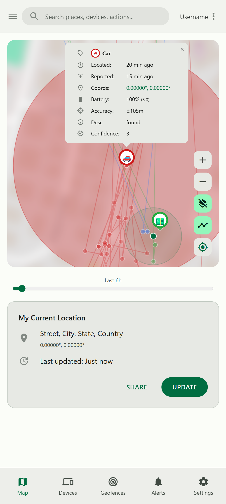
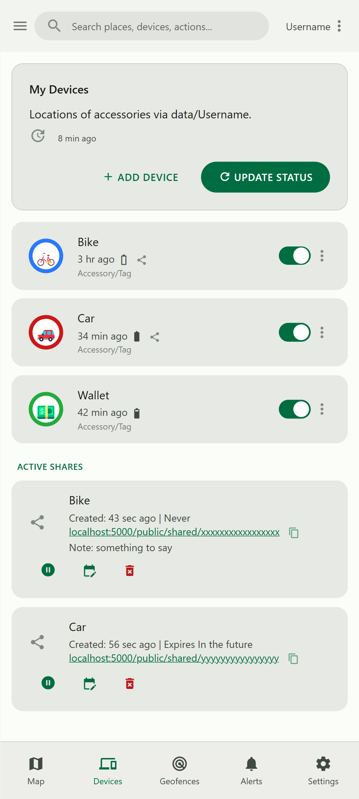
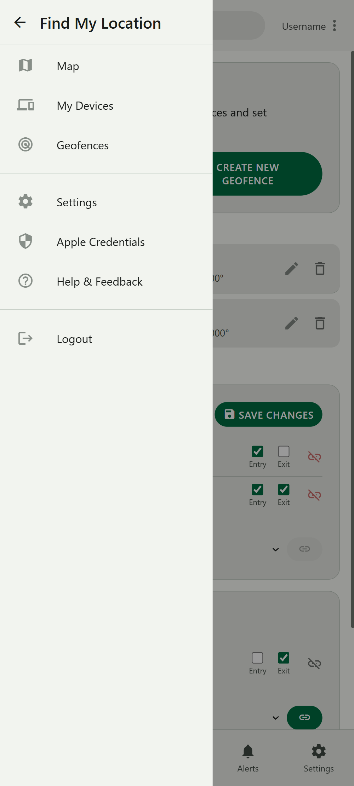
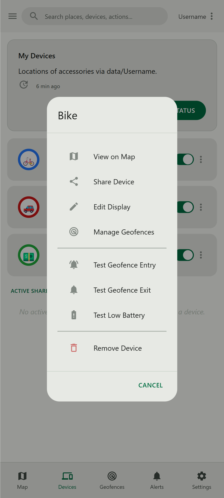
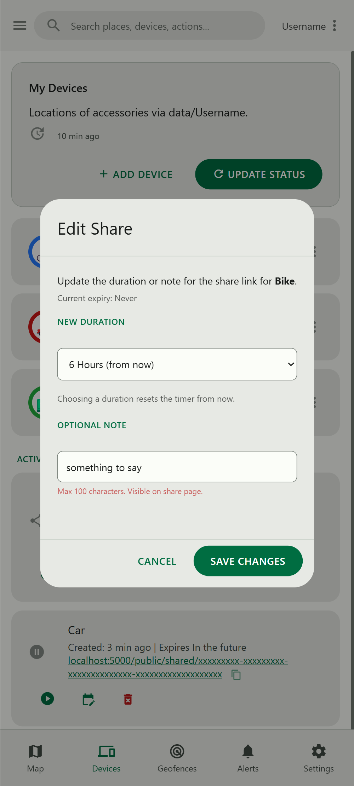

# FindMy WebApp & Scanner - A Multi-User, Dual-Platform Find My Alternative

[](https://opensource.org/licenses/MIT)
[](https://www.buymeacoffee.com/ghd182)

A self-hosted, multi-user system combining a **Flask web application** and a **native Android scanner app** designed as an alternative to Apple's Find My service. It tracks Apple devices (AirTags, iPhones, etc.) using [FindMy.py](https://github.com/malmeloo/FindMy.py) and provides a modern Material 3 interface, with enhanced local detection via the companion Android app.

| Interactive Map View | Device Management Dashboard |
|:--------------------:|:---------------------------:|
|  |  |

---

## Overview

This project provides a self-hosted system to locate Apple devices associated with multiple user accounts. It consists of:

1.  **Flask Web Application:** A central web interface for managing accounts, devices, viewing locations on an interactive map ([OpenStreetMap](https://www.openstreetmap.org/) & [Leaflet.js](https://leafletjs.com/)), configuring geofences, receiving alerts, and sharing device locations. Acts as the backend for the Android app.
2.  **Native Android Scanner App:** A companion app designed to perform **background Bluetooth LE scanning**, detect nearby owned devices (using locally derived keys) more frequently than server fetches, and report status back to the web backend via a secure API token.

### Key Features

- **Multi-User Support**: Each user manages their own Apple credentials and devices via the web app.
- **Apple Device Tracking**: Supports `.plist` or `.keys` files for device association (uploaded via web app).
- **Interactive Map (Web)**: Displays device locations with dynamic icons, popups, history trails, geofences.
- **Geofencing (Web)**: Create zones and receive entry/exit notifications.
- **Web Push Notifications**: Backend alerts for geofence events, low battery, and configurable "device not seen" events (delivered via web push).
- **Native Android Background Scanner**: Companion app performs periodic background BLE scanning for nearby device detection (using `WorkManager`). **(Scanning/Matching logic is currently under development).**
- **Scanner Authentication:** Android app securely authenticates with the backend API using user credentials to obtain a Bearer token, stored securely using `EncryptedSharedPreferences`.
- **Local Detection Reporting:** Android app reports locally detected devices (timestamp, battery status) to the backend API (`/api/scanner/report`), updating the `last_seen_local` field for devices.
- **Configurable Alerts (Web)**: Enable/disable low battery and "not seen" notifications per device. Set custom low battery thresholds per device.
- **Device Sharing (Web)**: Generate secure, time-limited (or indefinite), revocable public links for sharing device locations.
- **Local Share Geofences (Web)**: Viewers of shared links can define their own temporary geofences and receive browser notifications.
- **Integrated UI**: Android app embeds the web PWA (`WebViewFragment`), presenting a unified interface with a dedicated native scanner tab (`ScannerFragment`).
- **Conditional Web Scanner**: The web app's built-in (less reliable) Web Bluetooth scanner tab is automatically hidden when accessed from within the Android app wrapper.
- **Material 3 Design & Dynamic Theming**: Responsive UI with light/dark modes. The WebApp uses JavaScript for dynamic theming based on a user-selected accent color. The native Android app now also dynamically adopts this user-selected color for its Material 3 components, ensuring a consistent theme experience across both parts of the application when used together.
- **PWA Support**: Web app is installable as a Progressive Web App.
- **Dockerized Deployment (Web App)**: Easy setup for the Flask backend/frontend with Docker and Docker Compose.
- **FCM Infrastructure:** Firebase Cloud Messaging is integrated into the Android app for receiving push notifications (backend sending logic TBD).

---

## Technology Stack

- **Web Backend**: Python 3.11+, Flask, Waitress (WSGI), APScheduler, SQLAlchemy, Flask-Migrate, Flask-Login, Flask-WTF (CSRF), Flask-Limiter, SQLite (Default DB)
- **Web Frontend**: Vanilla JavaScript, HTML5, CSS3, Material 3 Design, [Material Color Utilities](https://github.com/material-foundation/material-color-utilities), Leaflet.js
- **Device Interaction**: [FindMy.py](https://github.com/malmeloo/FindMy.py)
- **Push Notifications**: `pywebpush` (Web Push), Google Firebase Cloud Messaging (FCM via Android App - receiving infrastructure in place)
- **Android App**: Kotlin, Android SDK, WorkManager, Android BLE API, Retrofit, OkHttp, Gson, ViewModel, LiveData, Material Components for Android (`DynamicColors`), AndroidX Security (`EncryptedSharedPreferences`), BouncyCastle (planned for crypto)
- **Deployment (Web App)**: Docker, Docker Compose
- **Authentication (Optional)**: Cloudflare Access (requires `/auth/reauth` route)

---

## Getting Started

### Prerequisites

- **Web App Deployment:**
    - Docker & Docker Compose
- **Native Android App Development/Use:**
    - Android Studio (latest stable recommended)
    - An Android device (or emulator) with Bluetooth LE support (Android 7+ for BLE, Android 10+ for reliable background scanning, Android 12+ for new BT permissions & dynamic theming)
- **Apple ID:** Must have Two-Factor Authentication (2FA) enabled and previously signed into an Apple device or macOS VM.
- **Firebase Project (for Android Notifications):** A Firebase project setup with Cloud Messaging enabled (requires a `google-services.json` file).

### Installation & Setup

#### 1. Web Application (Docker - Recommended)

1.  Clone the repository:
    ```bash
    git clone https://github.com/ghd182/findmy-webapp.git && cd findmy-webapp
    ```

#### Local Development (Not Recommended for Full Functionality)

2.  Create a virtual environment and install dependencies:
    ```bash
    python -m venv venv && source venv/bin/activate
    pip install -r requirements.txt
    ```
3.  **Initialize/Upgrade Database:** Run `flask db upgrade` to create or update the database schema (creates `data/app.db` if it doesn't exist).
4.  Configure environment variables in a `.env` file (see `docker-compose.yml` for variables - `.env` file itself is less used now).
5.  Run the app:
    ```bash
    python run.py
    ```
6.  Access the app at `http://localhost:5000`.

#### Docker Deployment (Recommended)
2.  Configure `docker-compose.yml`:
    - **CRITICAL:** Set strong, unique values for `SECRET_SEED`, `FERNET_SEED`, and `VAPID_SEED`.
    - Set `VAPID_CLAIMS_EMAIL` to your email (e.g., `mailto:you@example.com`).
    - **CRITICAL (Especially for Portainer):** Update volume paths for `./data` to use **absolute paths** on your host machine (e.g., `/home/your_user/findmy-app/data:/app/data`).
    - Customize optional variables (`TZ`, `FETCH_INTERVAL_MINUTES`, etc.) if needed.
3.  Build and run the containers:
    ```bash
    docker compose up -d --build
    ```
    *(Database migrations run automatically inside the container on startup via `flask db stamp head`).*
4.  Access the web app at `http://<your-docker-host-ip>:5000`.

#### 2. Android Application

1.  **Clone:** Ensure you have the repository cloned (same as step 1 above).
2.  **Firebase Setup:**
    *   Go to the [Firebase Console](https://console.firebase.google.com/).
    *   Create a new project or use an existing one.
    *   Add an Android app to the project.
    *   Use package name: `com.gh182.findmy`.
    *   Download the generated `google-services.json` file.
    *   Place the downloaded `google-services.json` file into the `FindMyAndroid/app/` directory (or your equivalent Android app module directory). **Do not commit this file.**
3.  **Open Project:** Open the Android project folder (`FindMyAndroid` or equivalent) in Android Studio.
4.  **Sync Gradle:** Let Android Studio sync the project with the Gradle files. It should download necessary dependencies (including BouncyCastle, AndroidX Security).
5.  **Build & Run:** Build and run the app on an emulator or physical device. (Android 12+ recommended for best dynamic theming experience).

---

## Usage

1.  **Web App:** Access the URL from your browser or the Android app. Register/Login.
2.  **Set Apple Credentials (Web):** `☰ Menu` ➔ `Apple Credentials`. Enter Apple ID & password. Complete 2FA if prompted.
3.  **Upload Device Files (Web):** `☰ Menu` ➔ `Settings` ➔ `Manage Device Files`. Upload `.plist`/`.keys`.
4.  **Link Android App (Android):** Navigate to the "Scanner" tab. Click "Link Account". Enter your WebApp username and password to generate and store an API token. Click "Unlink Account" to remove the token.
5.  **View Map (Web/Android):** Use the "Map" tab (Web) or the "Web App" tab (Android).
6.  **View Devices (Web/Android):** Use the "Devices" tab. Edit, Share, Manage Geofences. Note the "Last Seen Nearby" time updated by the Android scanner.
7.  **Manage Geofences (Web/Android):** Use the "Geofences" tab. Create global areas, link devices.
8.  **View Alerts (Web/Android):** Use the "Alerts" tab for notification history.
9.  **Use Scanner (Android):** Navigate to the "Scanner" tab. Toggle the "Background Scanning" switch to enable/disable the `WorkManager` task. *(Note: Actual scan results display is under development).*
10. **Web Scanner (Browser Only):** If accessing the web app directly in a compatible browser (not the Android app), the "Scanner" tab allows for foreground Web Bluetooth scanning. This tab is hidden inside the Android app.
11. **Settings (Web/Android):** Manage theme (accent color selection in WebApp will apply to Android native UI on next app start/recreate), map defaults, notification permissions (Web Push via browser), import/export, manage shares, delete account.
12. **Sharing (Web/Android):** Create/manage share links from the device menu.

---

## Gallery

### Main Features
| Map View | Devices List | Navigation Menu |
|:--------:|:------------:|:---------------:|
|  |  |  |

### Device Management & Android Scanner
| Device Options | Share Creation (Multi-Device) | Android Scanner Tab |
|:-------------:|:-----------------------------:|:-------------------:|
|  |  |  |


---

## Troubleshooting / FAQ

<details>
<summary>See details</summary>
<ul>
    <li><b>Login Failed / Background Fetch Errors / 2FA Required (Web App):</b>
        <ul>
            <li><b>Solution:</b> Ensure correct Apple ID/Password, 2FA enabled, account trust established (used on device/macOS VM), Anisette server running, check logs, complete interactive 2FA on Credentials page. Use regular password, NOT App-Specific Passwords here.</li>
        </ul>
    </li>
    <li><b>Web "Scanner" Tab Missing/Disabled (Android App):</b>
        <ul>
            <li><b>Cause:</b> This is intentional. When the web app detects it's running inside the Android wrapper, the less reliable Web Bluetooth scanner is hidden to avoid confusion with the native Android scanner tab.</li>
            <li><b>Solution:</b> Use the dedicated "Scanner" tab within the Android app for nearby scanning.</li>
        </ul>
    </li>
    <li><b>Android Scanner Tab: "Link Account" button doesn't work or gives error:</b>
        <ul>
             <li><b>Cause:</b> Network issue connecting to backend `/auth-api/generate_token`, incorrect WebApp username/password entered, backend API error.</li>
             <li><b>Solution:</b> Verify network connection. Double-check WebApp username/password. Check Flask backend logs for errors on the `/auth-api/generate_token` route.</li>
        </ul>
    </li>
    <li><b>Android Scanner Tab: Background Scanning switch doesn't stay on or gives error:</b>
        <ul>
             <li><b>Cause:</b> Account not linked (API token missing), required permissions not granted (Bluetooth, Location, Background Location), WorkManager failing to enqueue.</li>
             <li><b>Solution:</b> Ensure account is linked first. Grant all required permissions via App Settings (Allow Location "All the time"). Check Android Studio logs (Logcat) for `WorkManager`, `BleScanWorker`, or permission errors.</li>
        </ul>
    </li>
    <li><b>Android Scanner: No devices appear even when nearby:</b>
        <ul>
             <li><b>Cause:</b> Background scanning switch off, permissions missing, Bluetooth off, WorkManager task failing silently, key generation/matching logic not yet fully implemented in `BleScanWorker`/`KeyManager`, no device files uploaded for the linked user on the backend.</li>
             <li><b>Solution:</b> Verify account linked & switch enabled. Check all permissions. Ensure Bluetooth is ON. Check Android Studio Logcat for errors from `BleScanWorker`, `KeyManager`, or `WorkManager`. Check backend that `.keys` or `.plist` files are uploaded for the correct user. Wait for full implementation of scanning/matching logic.</li>
        </ul>
    </li>
    <li><b>Android App Build Error: `google-services.json is missing`</b>
         <ul>
            <li><b>Cause:</b> You haven't added the configuration file from Firebase.</li>
            <li><b>Solution:</b> Follow the Firebase Setup steps under "Installation & Setup" -> "Android Application" to download `google-services.json` and place it in the `app/` directory of the Android project, then rebuild.</li>
        </ul>
    </li>
     <li><b>Android App Build Error: Other Resource/Compile Errors</b>
         <ul>
            <li><b>Cause:</b> Missing drawables, incorrect layout references, Kotlin syntax errors, missing dependencies (sync Gradle).</li>
            <li><b>Solution:</b> Check the specific error message in Android Studio's build output. Ensure all referenced drawables exist, XML layouts are correct, Kotlin code has necessary imports, and Gradle dependencies are synced. Clean/Rebuild the project (`Build` -> `Clean Project`, `Build` -> `Rebuild Project`).</li>
        </ul>
    </li>
    <li><b>Notifications Not Working (Web Push - Browser):</b> Check browser permissions, VAPID setup (`VAPID_SEED`, `VAPID_CLAIMS_EMAIL`), subscription status (Settings), check notification toggles/cooldowns.</li>
     <li><b>Notifications Not Working (Native Android - FCM):</b>
        <ul>
             <li><b>Cause:</b> FCM setup incomplete, **backend not sending FCM tokens yet**, Google Play Services outdated/missing on device, network issues, notification channel issues, Android system notification settings blocking the app.</li>
             <li><b>Solution:</b> Verify `google-services.json` is correct. **Backend sending logic is TBD.** Ensure device has Google Play Services enabled and updated. Check Logcat for FCM token registration errors or message delivery failures. Check Android system notification settings for the app.</li>
        </ul>
    </li>
    <li><b>Theme Not Syncing Between Android/Web, or Android Native UI Does Not Match Web Accent Color:</b>
         <ul>
            <li><b>Cause:</b> Communication via the Javascript Interface might be encountering issues, or the native Android dynamic theming (Material You) might not be perfectly deriving all colors from the provided seed. Android 12+ is required for the best native dynamic theming experience.</li>
            <li><b>Status:</b> The WebApp, when logged in and running inside the Android App, sends its user-selected theme color to the Android native side via a JavaScript bridge. The Android `MainActivity` stores this color in SharedPreferences. On app start (`onCreate`), it attempts to apply this stored color as the source for Android's Material You dynamic theming using `DynamicColorsOptions.setContentBasedSource()`. If the color preference is changed in the web settings, the `MainActivity` is recreated to apply the new theme.</li>
            <li><b>Troubleshooting:</b> Ensure you are on Android 12+. Check Android Studio Logcat for messages from `MainActivity` related to "Found stored user theme color" or "Applying native theme". Verify the web settings are saving correctly. If the native UI elements (like bottom nav, status bar, scanner tab elements) don't fully match, it might be a limitation of how Material You derives all theme roles from a single seed color, or an issue in the application of `DynamicColors`.</li>
        </ul>
    </li>
    <li><b>No Devices Showing (Web App):</b> Check credentials, file uploads, wait for fetch interval, trigger manual refresh (`Devices` ➔ `Update Status`), check server logs (`findmyapp` and `anisette`).</li>
    <li><b>Web Push Notifications Not Working:</b> Check browser permission, VAPID setup (`VAPID_SEED`, `VAPID_CLAIMS_EMAIL`), subscription status (Settings), check per-device notification toggles (Edit Device), check geofence link notification toggles, low battery threshold (global and per-device), cooldown period, "not seen" threshold.</li>
    <li><b>"Not Seen" Alerts Triggering Unexpectedly:</b> Check the "Not Seen Threshold" (global in config, per-device in Edit Device). Ensure background fetches are running successfully (check logs). Temporary network issues or Apple service delays can affect location reporting frequency.</li>
    <li><b>Shared Link Geofences/Notifications Not Working:</b> These are *local* to the browser viewing the link. The share page tab must remain open for checks and notifications to occur. They do not use the backend push system.</li>
    <li><b>Cannot Change Fetch Interval Per User:</b> This is currently not supported due to the global background task architecture. The fetch interval is set globally in the `docker-compose.yml` or `.env`.</li>
    <li><b>Map Issues:</b> Clear cache, check internet, check browser console (F12).</li>
    <li><b>Docker Permissions:</b> Ensure host `./data` directory (specified in `docker-compose.yml` volumes) is writable by the container user (often UID/GID 1000). Use `sudo chown -R 1000:1000 ./data` on the host or Docker volumes if issues persist. This directory holds the SQLite database and cache files.</li>
    <li><b>VAPID Seed Failure:</b> If logs mention "scalar... outside the valid range", use a <i>different</i> random string for `VAPID_SEED` and restart.</li>
    <li><b>Updating:</b> Pull latest code (`git pull`), rebuild images (`docker compose build`), redeploy (`docker compose up -d` or Portainer "Update the stack" with "Re-pull image"). The Docker entrypoint should handle DB migrations (`stamp head`).</li>
    <li><b>Data Storage:</b> Core user/device/config data is stored in an SQLite database file (`app.db`) within the persistent `data/` directory. API tokens are stored hashed in the DB. Android stores its API token securely using `EncryptedSharedPreferences`. Device key files (`.plist`, `.keys`) and temporary cache (`cache.json`) reside in user subdirectories within `data/`. Ensure the `data/` directory is backed up.</li>
    <li><b>Database Migrations (Non-Docker):</b> If running locally without Docker and updating, you might need to apply database migrations using `flask db upgrade` after pulling new code and installing requirements. Docker users: The `Dockerfile` now uses `flask db stamp head` on startup to align the DB schema record with the latest migration code, which is generally safe if the tables already exist correctly.</li>
</ul>
</details>

---

## Future Improvements / Roadmap

See [TODO.md](TODO.md) for a detailed list. Key areas include full native scanner implementation (BLE scanning, key matching, UI results display), robust FCM handling, performance tuning, and UI polishing.

---

## License

This project is licensed under the MIT License. See the `LICENSE` file for details.

---

## Credits & Acknowledgements

This project uses the following third-party libraries and tools:

- **[FindMy.py](https://github.com/malmeloo/FindMy.py)** ([MIT License](https://opensource.org/licenses/MIT)): Core library for interacting with Apple's Find My network.
- **[OpenHaystack](https://github.com/seemoo-lab/openhaystack)** ([AGPL-3.0 License](https://www.gnu.org/licenses/agpl-3.0.en.html)): Firmware and tools for custom tracking tags.
- **[Anisette V3 Server](https://github.com/Dadoum/anisette-v3-server)**: Anisette server for authentication.
- **[Material Color Utilities](https://github.com/material-foundation/material-color-utilities)** ([Apache-2.0 License](https://www.apache.org/licenses/LICENSE-2.0)): Dynamic theming utilities.
- **[Leaflet.js](https://leafletjs.com/)** ([BSD-2-Clause License](https://opensource.org/licenses/BSD-2-Clause)): Interactive map library.
- **[OpenStreetMap](https://www.openstreetmap.org/)** ([ODbL 1.0](https://opendatacommons.org/licenses/odbl/)): Map data source.
- **[Retrofit/OkHttp](https://square.github.io/okhttp/)** ([Apache-2.0 License](https://www.apache.org/licenses/LICENSE-2.0)): Android networking.
- **[AndroidX Libraries](https://developer.android.com/jetpack)** ([Apache-2.0 License](https://www.apache.org/licenses/LICENSE-2.0)): ViewModel, WorkManager, Security.
- **[Firebase SDK](https://firebase.google.com/docs/android/setup)** ([Apache-2.0 License](https://www.apache.org/licenses/LICENSE-2.0)): Cloud Messaging.
- **[Find My Device Icon](https://github.com/lawnchairlauncher/lawnicons)** ([Apache-2.0 License](https://www.apache.org/licenses/LICENSE-2.0)): From Lawnicons collection.

Please refer to the respective repositories for detailed license information.

---

## Contributing / Contact

Contributions are welcome! For questions, feedback, or support, please open an [Issue Repository](https://github.com/ghd182/findmy-webapp/issues) or submit a [Pull Request](https://github.com/ghd182/findmy-webapp/pulls). Consider adding tests and following existing code style.

> **Disclaimer:** This project relies on unofficial methods to interact with Apple's services. These methods may change or break without notice. Using your Apple ID credentials in third-party applications carries inherent security risks. This project is intended for personal, educational purposes and is not affiliated with or endorsed by Apple Inc. Use responsibly and at your own risk. Respect privacy laws.