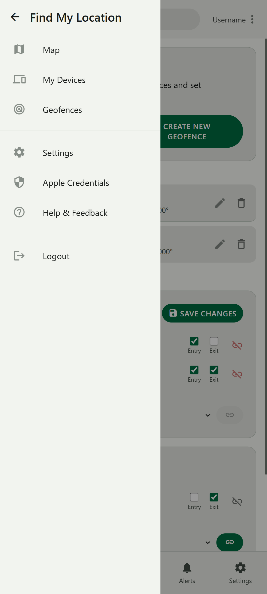

# FindMy WebApp - A Multi-User Find My Alternative

[](https://github.com/ghd182/findmy-multiuser/actions)
[](https://opensource.org/licenses/MIT)
[](https://github.com/ghd182/findmy-multiuser) <!-- Ensure this matches config.py -->

A self-hosted, multi-user web application designed as an alternative to Apple's Find My service, focusing on tracking Apple devices (like AirTags, iPhones, MacBooks) using [FindMy.py](https://github.com/malmeloo/FindMy.py) with a modern, responsive Material 3 interface.

<!-- App Screenshots -->
<div style="display: flex; flex-wrap: wrap; gap: 20px; justify-content: center; margin: 40px 0;">
    <div style="text-align: center;">
        
        <p style="margin-top: 10px; font-style: italic; color: #666;">Interactive Map View</p>
    </div>
    <div style="text-align: center;">
        
        <p style="margin-top: 10px; font-style: italic; color: #666;">Device Management Dashboard</p>
    </div>
</div>

## Overview

This project provides a self-hosted web interface accessible from any device to locate your Apple accessories (AirTags, iPhones, etc.). It fetches location data periodically using the excellent [malmeloo/FindMy.py](https://github.com/malmeloo/FindMy.py) library and presents it on an interactive map (OpenStreetMap via Leaflet.js).

Beyond basic tracking, it offers multi-user support with secure login, geofencing with push notifications, low battery alerts, location history viewing, device sharing via public links, dynamic Material 3 theming (adapting to your system or chosen preference), and PWA support for app-like installation. It's designed for easy deployment using Docker, making it ideal for home servers like a Raspberry Pi, and includes a local Anisette server for reliable authentication.

## Key Features

*   **Multi-User Support:** Secure user registration and login. Each user manages their own Apple credentials and device data independently.
*   **Apple Device Tracking:** Locates accessories linked to an Apple ID using the [FindMy.py](https://github.com/malmeloo/FindMy.py) library. Supports devices associated via `.plist` or `.keys` files (e.g., from OpenHaystack). Fetches and stores historical location data for trail viewing.
*   **Interactive Map:** Displays device locations on an [OpenStreetMap](https://www.openstreetmap.org/) base layer using [Leaflet.js](https://leafletjs.com/).
    *   Dynamic, colored SVG icons based on user-defined labels (emojis supported).
    *   Popups showing device name, last update time (relative & absolute), battery status, coordinates, and accuracy.
    *   Map controls: Zoom, Center on user location, Show all visible devices, Toggle history trails.
*   **Location History:** View the recent location history trail for visible devices directly on the map. Filter history duration using an intuitive slider (1 hour to 7 days).
*   **Material 3 Design:** Modern, responsive interface adhering to Material 3 guidelines.
    *   **Light/Dark Modes:** Follows system preference or allows manual override.
    *   **Dynamic Color Theming:** Adapts UI colors based on a user-selected accent color (using Material Color Utilities).
*   **Geofencing:**
    *   Create/Edit/Delete custom circular geofence zones visually on a map.
    *   Link geofences to specific devices.
    *   Configure entry and/or exit push notifications per device-geofence link.
*   **Notifications:**
    *   **Geofence Alerts:** Receive push notifications upon device entry or exit from linked geofences.
    *   **Low Battery Alerts:** Receive push notifications when a device's battery level falls below a configurable threshold.
    *   **Web Push:** Uses Web Push API for real-time alerts (requires VAPID key setup and user permission in browser).
    *   **Notification History:** View a dedicated "Alerts" page showing a history of notifications sent by the backend. Manage read/unread status and delete history entries.
*   **Device Sharing:**
    *   Create secure, time-limited (e.g., 1h, 24h, 7d) or indefinite public links to share a specific device's live location. Add optional notes to shares.
    *   Viewers access a simplified, read-only map page without needing to log in.
    *   Manage created share links from Settings: View URL, Copy URL, Suspend/Resume, Update duration/note, Delete permanently.
*   **Device Configuration:** Customize device display names, map icon labels (emojis supported, up to 2 characters), and icon colors. Toggle map visibility per device.
*   **Secure Credential Storage:** Apple passwords are encrypted using Fernet symmetric encryption (requires `FERNET_SEED` or `FERNET_KEY`).
*   **Configuration Import/Export:** Backup and restore user configuration (device settings, geofences, UI preferences, visibility states, etc.) via JSON file download/upload.
*   **Account Management:** Users can delete their account and all associated data permanently.
*   **PWA Support:** Installable as a Progressive Web App (PWA) on compatible devices for a more native app experience. Includes basic offline caching for the app shell via Service Worker.
*   **Seed-Based Key Generation:** **(Recommended)** Deterministically generates the Flask `SECRET_KEY`, `FERNET_KEY` for encryption, and VAPID keys for push notifications from user-provided seed environment variables. Simplifies secret management and ensures key persistence across container restarts.
*   **Dockerized:** Easy deployment using Docker and Docker Compose. Optimized Dockerfile for `linux/arm64/v8` (Raspberry Pi 4/5 and other ARM devices). Includes `ProxyFix` middleware for correct operation behind reverse proxies. Includes local Anisette server service for reliable authentication.

## Technology Stack

*   **Backend:** Python 3.11+, Flask, Waitress (WSGI Server), APScheduler (Task Scheduling)
*   **Device Interaction:** [FindMy.py](https://github.com/malmeloo/FindMy.py)
*   **Authentication Helper:** [dadoum/anisette-v3-server](https://github.com/Dadoum/anisette-v3-server) (Included in Docker Compose)
*   **Frontend:** Vanilla JavaScript (ES Modules), HTML5, CSS3
*   **Mapping:** Leaflet.js
*   **Styling:** Material 3 Design principles (CSS variables), Material Icons & Symbols, [Material Color Utilities](https://github.com/material-foundation/material-color-utilities) (JS library for dynamic theming)
*   **Push Notifications:** `pywebpush`, Web Push API, VAPID
*   **Security/Auth:** Flask-Login, Flask-WTF (CSRF protection), Werkzeug password hashing, `cryptography` (Fernet encryption, HKDF for key derivation)
*   **Deployment:** Docker, Docker Compose

## Getting Started

### Prerequisites

*   **Python:** Version 3.11 or higher recommended.
*   **Pip:** Python package installer.
*   **Git:** For cloning the repository.
*   **Docker & Docker Compose:** (Required for Docker/Portainer deployment) Install Docker Engine and Docker Compose V2.
*   **Apple ID:**
    *   You need a standard Apple ID (email address).
    *   **Two-Factor Authentication (2FA) MUST be enabled** on the account.
    *   You will use your **regular Apple ID password** in this application's settings, **NOT an App-Specific Password**.
    *   **Important:** The Apple ID likely needs to have been signed into an Apple device (iPhone, iPad, Mac) at least once previously. This establishes trust required by Apple's services, which `FindMy.py` and the Anisette server leverage. Using a brand new Apple ID that has never been used on hardware may not work.
    *   **(Apple Hardware Alternative):** For users without physical Apple devices, it *might* be possible to establish this initial trust by signing into iCloud within a macOS virtual machine. Projects like **[sickcodes/Docker-OSX](https://github.com/sickcodes/Docker-OSX)** can facilitate running macOS in Docker, potentially allowing this initial sign-in. Success with this method may vary depending on Apple's security measures.
*   **Anisette Server (Recommended):** Required by [FindMy.py](https://github.com/malmeloo/FindMy.py) for authentication. The included `docker-compose.yml` runs a local instance (`dadoum/anisette-v3-server`) for reliability, which is the recommended approach.
*   **Device Files:** `.plist` or `.keys` files for the Apple devices (e.g., AirTags using OpenHaystack firmware) you want to track.

### Configuration (Environment Variables & Seeds)

This application relies on environment variables for configuration, especially secrets. **Using the SEED variables is strongly recommended.**

1.  **Generate Seeds:** Create three unique, strong, secret phrases (e.g., using `python -c "import secrets; print(secrets.token_hex(32))"` for each). Store these securely.
    *   `SECRET_SEED`: For Flask session signing (`SECRET_KEY`).
    *   `FERNET_SEED`: For encrypting stored Apple passwords (`FERNET_KEY`).
    *   `VAPID_SEED`: For generating push notification keys (VAPID).

2.  **Set Environment Variables:** Provide these seeds and other required variables.

    **Required Variables:**
    *   `FLASK_ENV`: `production` (for Docker) or `development` (for local).
    *   `SECRET_SEED`: Your generated seed for Flask.
    *   `FERNET_SEED`: Your generated seed for encryption.
    *   `VAPID_SEED`: Your generated seed for VAPID keys.
    *   `VAPID_CLAIMS_EMAIL`: Your email, prefixed with `mailto:` (e.g., `mailto:you@example.com`).
    *   `TZ`: Your timezone (e.g., `Europe/Amsterdam`, `America/New_York`).

    **Optional Variables (Defaults are in `config.py`):**
    *   `LOG_LEVEL`: `DEBUG`, `INFO`, `WARNING`, `ERROR` (Default: `INFO`).
    *   `WAITRESS_THREADS`: Number of worker threads (Default: `4`).
    *   `LOW_BATTERY_THRESHOLD`: Alert threshold % (Default: `15`).
    *   `DEFAULT_FETCH_INTERVAL_MINUTES`: Default scan interval (Default: `15`).
    *   `FETCH_INTERVAL_MINUTES`: Master job interval (Default: `15`).
    *   `HISTORY_DURATION_DAYS`: How many days of history to fetch (Default: `7`).
    *   `NOTIFICATION_COOLDOWN_SECONDS`: Min seconds between similar alerts (Default: `300`).
    *   `NOTIFICATION_HISTORY_DAYS`: How many days of alerts to keep (Default: `30`).
    *   `ANISETTE_SERVERS`: Comma-separated list of Anisette server URLs.
        *   **Docker Compose Default:** `http://anisette:6969` (uses included service).
        *   **Manual/Other:** Set explicitly if needed.

### 1. Local Development Setup

**(Not recommended for full functionality due to Anisette server dependency)**

1.  **Clone:** `git clone https://github.com/Ghodmode/findmy-multiuser.git && cd findmy-multiuser`
2.  **Virtual Env:** `python -m venv venv && source venv/bin/activate` (or `venv\Scripts\activate` on Windows)
3.  **Install:** `pip install -r requirements.txt`
4.  **Configure:** Create a `.env` file (see `.env.example` or variables list above). Set `FLASK_ENV=development`. **Crucially, you MUST provide `ANISETTE_SERVERS` pointing to a running Anisette server (either public or one you run separately).**
5.  **Run:** `python run.py`
6.  **Access:** `http://localhost:5000`

### 2. Docker Setup (using Docker Compose)

This is the **recommended** method. It runs the app and the Anisette server together.

1.  **Clone:** `git clone https://github.com/Ghodmode/findmy-multiuser.git && cd findmy-multiuser`
2.  **Configure `docker-compose.yml`:**
    *   Edit the `environment:` section under the `findmyapp:` service.
    *   Set `TZ`, `VAPID_CLAIMS_EMAIL`, and **replace ALL placeholder `*_SEED` values** with your generated secrets.
    *   Adjust optional variables (like `WAITRESS_THREADS`) if needed. `ANISETTE_SERVERS` is correctly pre-set.
    *   Verify the `volumes:` mapping for `./data:/app/data`.
    ```yaml
    # docker-compose.yml (Example Snippet - see full file)
    services:
      findmyapp:
        # ... (build, platform, image, container_name, restart, ports) ...
        volumes:
          - ./data:/app/data # Ensure this path works for you, or use absolute
        environment:
          FLASK_ENV: production
          LOG_LEVEL: INFO
          TZ: Europe/Amsterdam # CHANGE ME
          WAITRESS_THREADS: 8
          # --- Key Generation Seeds (REPLACE THESE!) ---
          SECRET_SEED: "replace-this-with-your-very-long-and-random-secret-phrase-for-sessions"
          FERNET_SEED: "replace-this-with-your-another-different-long-random-secret-phrase-for-encryption"
          VAPID_SEED: "replace-this-with-your-a-third-unique-long-random-phrase-for-push-keys"
          # --- Other Required Variables ---
          VAPID_CLAIMS_EMAIL: "mailto:your_email@example.com" # CHANGE ME
          # --- Anisette Server (Points to internal service) ---
          ANISETTE_SERVERS: "http://anisette:6969"
          # ... other optional variables ...
        depends_on:
          - anisette # Make sure anisette starts first

      anisette:
        image: dadoum/anisette-v3-server:latest
        container_name: anisette-server
        restart: unless-stopped
    ```
3.  **Build (Optional but recommended):** `docker compose build`
4.  **Run:** `docker compose up -d`
5.  **Access:** Open `http://<your-docker-host-ip>:5000`.
6.  **Data:** User data is in `./data` on host. Anisette runs internally.
7.  **Logs:** `docker compose logs findmyapp` and `docker compose logs anisette`.

### 3. Portainer Setup (Stack Deployment)

1.  **Prepare Host:** Ensure Docker is running. Clone repo (e.g., `/home/user/findmy-webapp`).
2.  **Prepare Stack Definition:**
    *   Copy contents of `portainer_docker-compose.yml`.
    *   **Change `volumes:` path for `findmyapp` service to *absolute host path*** (e.g., `- /home/user/findmy-webapp/data:/app/data`). Anisette service needs no volumes.
    *   Verify/Set all `findmyapp` `environment` variables (SEEDS, TZ, VAPID_CLAIMS_EMAIL). `ANISETTE_SERVERS` should be `http://anisette:6969`.
3.  **Deploy in Portainer:** "Stacks" ➔ "Add stack" ➔ Name it ➔ "Web editor" ➔ Paste YAML ➔ "Deploy".
4.  **Access:** Open `http://<your-host-ip>:5000`.

## Usage

1.  **Access & Register/Login:** Open the app URL. Create an account or log in.
2.  **Set Apple Credentials:** Navigate `☰ Menu` ➔ `Apple Credentials`. Enter your Apple ID email and **your regular Apple ID password**. Save. (An initial data fetch is triggered).
3.  **Upload Device Files:** Navigate `☰ Menu` ➔ `Settings` ➔ `Manage Device Files`. Upload `.plist` or `.keys` files. (Another fetch is triggered).
4.  **View Map:** Go to `Map` tab. Devices appear after background fetch. Use controls (Zoom, My Location, Show All, History Toggle/Slider). Click markers for info popups.
5.  **View Devices:** Go to `Devices` tab for list. Click item to center map. Use `⋮` menu (Edit, Share, Geofences, Test Notifications, Remove). Toggle map visibility (eye icon).
6.  **Manage Geofences:** Go to `Geofences` tab. Create global areas ("+" button). Link/unlink devices and configure notifications per link in device cards.
7.  **View Alerts:** Go to `Alerts` tab for notification history. Manage read/unread/delete.
8.  **Configure Settings:** Go to `Settings` tab. Manage theme/color, map defaults, notification permissions, import/export, manage active shares, delete account.

## Gallery
### Main Features
| Map View | Devices List | Navigation Menu |
|:--------:|:------------:|:---------------:|
|  |  |  |
| Interactive map with device locations | List of tracked devices | Main navigation drawer |

### Device Management
| Device Options | Share Creation | Shared View |
|:-------------:|:--------------:|:-----------:|
|  |  |  |
| Device-specific actions | Create public share links | Guest view of shared device |

### Geofencing & Notifications
| Geofences List | Geofence Settings | Notifications |
|:-------------:|:-----------------:|:-------------:|
|  |  |  |
| Manage geofence zones | Configure geofence options | View alert history |

### Settings & Themes
| General Settings | Color Themes | Dark Mode |
|:---------------:|:------------:|:---------:|
|  |  |  |
| App configuration | Dynamic color theming | Dark theme support |


## Troubleshooting / FAQ

*   **Login Failed / Background Fetch Errors / 2FA Required:**
    *   **Cause:** Authentication with Apple failed.
    *   **Solution:**
        1.  Ensure you entered your **correct Apple ID email and REGULAR password** (not an App-Specific Password).
        2.  Verify **2FA is ENABLED** on the Apple ID account.
        3.  Confirm the Apple ID has been **previously used on an Apple device** (iPhone, Mac, etc.) or signed into iCloud within a **macOS virtual machine** (e.g., using [Docker-OSX](https://github.com/sickcodes/Docker-OSX)) to establish trust.
        4.  Check the **Anisette server** status (`docker compose logs anisette`). If it's crashing or showing errors, the authentication process will fail. Ensure it's running and `ANISETTE_SERVERS` points to it.
        5.  Check the `findmyapp` logs (`docker compose logs findmyapp`) for specific error messages from `FindMy.py`.
*   **No Devices Showing:** Check credentials, file uploads, wait for fetch interval, trigger manual refresh (`Devices` ➔ `Update Status`), check server logs (`findmyapp` and `anisette`).
*   **Notifications Not Working:** Check browser permission, VAPID setup (`VAPID_SEED`, `VAPID_CLAIMS_EMAIL`), subscription status (Settings), geofence link notification toggles, low battery threshold, cooldown period.
*   **Map Issues:** Clear cache, check internet, check browser console (F12).
*   **Docker Permissions:** Ensure host `./data` directory is writable by the container user (often UID/GID 1000). Use `sudo chown -R 1000:1000 ./data` or Docker volumes.
*   **VAPID Seed Failure:** If logs mention "scalar... outside the valid range", use a *different* random string for `VAPID_SEED` and restart.
*   **Updating:** Pull latest code (`git pull`), rebuild images (`docker compose build`), redeploy (`docker compose up -d` or Portainer "Update the stack" with "Re-pull image").
*   **Data Storage:** User data in `data/` (mapped to `/app/data` in container).

## Contributing

Contributions are welcome! Please open an issue or submit a Pull Request. Consider adding tests and following existing code style.

## Future Improvements / Roadmap

See [TODO.md](TODO.md) for a detailed list. Key areas include database migration, Play Sound/Lost Mode, performance tuning, enhanced security, and UI polishing.

## License

This project is licensed under the MIT License - see the `LICENSE` file for details.

## Credits & Acknowledgements

*   **[FindMy.py](https://github.com/malmeloo/FindMy.py):** The core library enabling interaction with Apple's Find My network.
*   **[Dadoum/anisette-v3-server](https://github.com/Dadoum/anisette-v3-server):** For the crucial Anisette server implementation enabling authentication.
*   **[OpenHaystack](https://github.com/seemoo-lab/openhaystack):** For the inspiration and firmware for custom tracking tags.
*   Flask, Leaflet.js, Material Design, pywebpush, Cryptography, Waitress, APScheduler, Docker.
*   **(Inspiration):** Apple's Find My service.

## Contact

For questions, feedback, or support, please open an issue on the [GitHub Repository](https://github.com/Ghodmode/findmy-multiuser/issues).

---

> **Disclaimer:** This project relies on unofficial methods to interact with Apple's services. These methods may change or break without notice. Using your Apple ID credentials in third-party applications carries inherent security risks. This project is intended for personal, educational purposes and is not affiliated with or endorsed by Apple Inc. Use responsibly and at your own risk. Respect privacy laws.